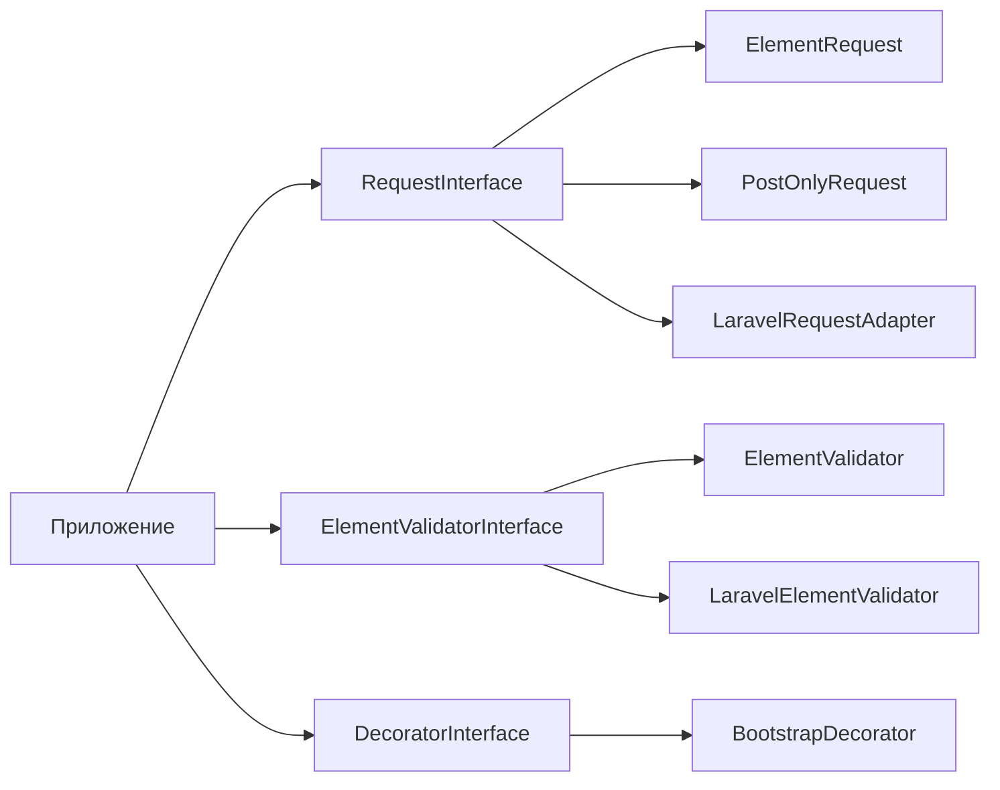

# form-generator

PHP-библиотека для программного создания HTML-форм, привязки данных из запроса, валидации и рендеринга с опциональным Bootstrap-декоратором.

## Требования

- PHP ^8.2
- Composer

## Установка

```bash
composer require kavalhub/form-generator
```

### Laravel (опционально)

```bash
composer require kavalhub/form-generator-laravel
```

## Быстрый старт

```php
use Kavalhub\FormGenerator\Form\Form;
use Kavalhub\FormGenerator\Form\InputSubmit;
use Kavalhub\FormGenerator\Form\InputText;
use Kavalhub\FormGenerator\Request\ElementRequest;
use Kavalhub\FormGenerator\Validator\ElementValidator;
use Kavalhub\FormGenerator\Validator\Interface\ElementValidatorInterface;

$form = (new Form('contact'))
    ->addElement(
        (new InputText('email'))->setRequired()->setPlaceholder('Email')
    )
    ->addElement(
        (new InputSubmit('send'))->setDefaultValue('Отправить')
    );

/** @var ElementValidatorInterface $validator */
$validator = new ElementValidator(new ElementRequest());
$submit = $form->getByName('send');

if ($validator->checkSubmit($submit) && $validator->handle($form)) {
    // данные валидны
}

echo $form->getHtml();
```

## Точки расширения

Библиотека построена на интерфейсах — реализации можно подменять:

| Интерфейс | Назначение | Реализации в пакете |
|-----------|------------|---------------------|
| [`RequestInterface`](src/Request/Interface/RequestInterface.php) | Источник данных формы | `ElementRequest`, `ArrayRequest`, `PostOnlyRequest` |
| [`ElementValidatorInterface`](src/Validator/Interface/ElementValidatorInterface.php) | Валидация и bind | `ElementValidator` |
| [`DecoratorInterface`](src/Decorator/Interface/DecoratorInterface.php) | Рендеринг с темой | `BootstrapDecorator` |



## Request: GET, POST и свои адаптеры

### `ElementRequest` — по умолчанию (`$_REQUEST`)

Читает **GET + POST + cookies**. Подходит для фильтров и форм, отправляемых GET-запросом (см. `FacetProductForm` в `example/`).

```php
$request = new ElementRequest();
```

### `PostOnlyRequest` — только POST

```php
use Kavalhub\FormGenerator\Request\PostOnlyRequest;

$request = new PostOnlyRequest();
```

### `ArrayRequest` — для тестов и API

```php
use Kavalhub\FormGenerator\Request\ArrayRequest;

$request = new ArrayRequest(['contact_email' => 'a@b.c']);
```

### Свой адаптер

Реализуйте `RequestInterface::get(string $name): ?array` — метод возвращает массив значений для поля с данным именем (`getFormName()`).

## Validator

Контракт [`ElementValidatorInterface`](src/Validator/Interface/ElementValidatorInterface.php):

- `checkSubmit(InputSubmit $submit): bool` — была ли отправлена форма
- `handle(ElementInterface $element): bool` — bind из request, required, callbacks, CSRF
- `isValid(): ?bool` — результат последней проверки

Внедряйте интерфейс, а не конкретный класс:

```php
public function __construct(private readonly ElementValidatorInterface $validator) {}
```

### Callback-валидаторы

```php
$input->addCallbackValidator(function (InputText $el): bool {
    if (!str_contains($el->getValue(), '@')) {
        $el->addError(['Некорректный email']);
        return false;
    }
    return true;
});
```

## Laravel-интеграция

Пакет [`kavalhub/form-generator-laravel`](packages/laravel/) — гибридный валидатор:

1. **Core** (`ElementValidator`) — bind, required, callbacks, CSRF
2. **Laravel** (`illuminate/validation`) — правила `required|email` и т.д.

```php
use Illuminate\Validation\Factory;
use Kavalhub\FormGenerator\Form\Form;
use Kavalhub\FormGenerator\Form\InputText;
use Kavalhub\FormGenerator\Laravel\LaravelElementValidator;
use Kavalhub\FormGenerator\Laravel\LaravelRequestAdapter;

$request = new LaravelRequestAdapter($illuminateRequest);
$validator = new LaravelElementValidator($request, app(Factory::class));
$validator->setRules([
    'contact_email' => 'required|email',
]);

$form = (new Form('contact'))->addElement((new InputText('email'))->setRequired());

if ($validator->handle($form)) {
    // OK
}
```

Ошибки Laravel автоматически попадают в `addError()` элементов через [`ElementDataCollector`](src/Util/ElementDataCollector.php).

## Bootstrap-декоратор

```php
use Kavalhub\FormGenerator\Decorator\Bootstrap\BootstrapDecorator;
use Kavalhub\FormGenerator\Decorator\Interface\DecoratorInterface;

/** @var DecoratorInterface $decorator */
$decorator = new BootstrapDecorator($form);
echo $decorator->getHtml();
```

Bootstrap сейчас входит в основной пакет. В будущем может быть вынесен в `kavalhub/form-generator-bootstrap`.

## CSRF-защита (opt-in)

```php
$form = (new Form('secure'))
    ->enableCsrf()
    ->addElement(/* ... */);
```

## Сбор данных из дерева элементов

```php
use Kavalhub\FormGenerator\Util\ElementDataCollector;

$data = ElementDataCollector::collectByFormName($form);
// ['contact_email' => 'user@example.com', ...]
```

## Поддерживаемые элементы

| Класс | Описание |
|-------|----------|
| `Form` | Контейнер `<form>` |
| `Group` | Группа полей с префиксом имени |
| `InputText`, `InputPassword`, `InputNumber` | Текстовые поля |
| `InputCheckbox`, `InputRadio` | Переключатели |
| `Select`, `Option` | Выпадающий список |
| `Textarea` | Многострочный ввод |
| `InputHidden`, `InputSubmit`, `Button` | Скрытые и кнопки |
| `Label`, `Nav`, `Link` | Разметка |
| `Table`, `Tr`, `Td`, `Th` | Таблицы |

## Безопасность

- Значения полей, placeholder, href и сообщения об ошибках экранируются через `HtmlEscaper`.
- `Label::setAllowHtml()` — явное разрешение HTML в подписи.
- `ElementRequest` использует `$_REQUEST` — удобно для GET-фильтров; для POST-only используйте `PostOnlyRequest`.
- CSRF включается явно через `Form::enableCsrf()`.

## Тесты

```bash
composer install
composer test
```

## Лицензия

MIT
