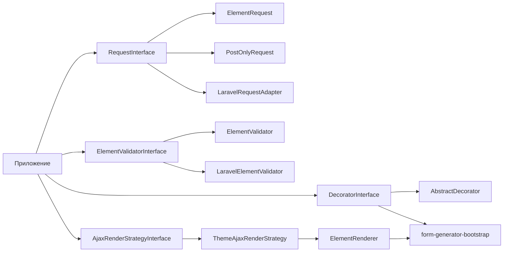

# form-generator

PHP-библиотека для программного создания HTML-форм, привязки данных из запроса, валидации и рендеринга с опциональным Bootstrap-декоратором.

## Требования

- PHP ^8.2
- Composer

## Установка

```bash
composer require kavalhub/form-generator
```

### Laravel (опционально)

```bash
composer require kavalhub/form-generator-laravel
```

## Быстрый старт

```php
use Kavalhub\FormGenerator\Html\Form;
use Kavalhub\FormGenerator\Html\InputSubmit;
use Kavalhub\FormGenerator\Html\InputText;
use Kavalhub\FormGenerator\Request\ElementRequest;
use Kavalhub\FormGenerator\Validator\ElementValidator;
use Kavalhub\FormGenerator\Validator\Interface\ElementValidatorInterface;

$form = (new Form('contact'))
    ->addElement(
        (new InputText('email'))->setRequired()->setPlaceholder('Email')
    )
    ->addElement(
        (new InputSubmit('send'))->setDefaultValue('Отправить')
    );

/** @var ElementValidatorInterface $validator */
$validator = new ElementValidator(new ElementRequest());
$submit = $form->getByName('send');

if ($validator->checkSubmit($submit) && $validator->handle($form)) {
    // данные валидны
}

echo $form->render();
```

## Точки расширения

Библиотека построена на интерфейсах — реализации можно подменять:

| Интерфейс | Назначение | Реализации в пакете |
|-----------|------------|---------------------|
| [`RequestInterface`](src/Request/Interface/RequestInterface.php) | Источник данных формы | `ElementRequest`, `ArrayRequest`, `PostOnlyRequest` |
| [`ElementValidatorInterface`](src/Validator/Interface/ElementValidatorInterface.php) | Валидация и bind | `ElementValidator` |
| [`DecoratorInterface`](src/Decorator/Interface/DecoratorInterface.php) | Рендеринг с темой | [`AbstractDecorator`](src/Decorator/AbstractDecorator.php); Bootstrap — пакет [`form-generator-bootstrap`](packages/bootstrap/) |
| [`AjaxRenderStrategyInterface`](src/Ajax/Interface/AjaxRenderStrategyInterface.php) | AJAX-патчи поверх текущей темы renderer | [`ThemeAjaxRenderStrategy`](src/Ajax/ThemeAjaxRenderStrategy.php); BC: `NullAjaxRenderStrategy`, bootstrap-пакет |
| [`ElementEventDispatcher`](src/Event/ElementEventDispatcher.php) | События элементов (связанные select, фильтры) | `ElementChangedEvent`, слушатели в приложении |

Подробнее: [docs/element-events.md](docs/element-events.md), [docs/custom-templates.md](docs/custom-templates.md).



## Request: GET, POST и свои адаптеры

### `ElementRequest` — по умолчанию (`$_REQUEST`)

Читает **GET + POST + cookies**. Подходит для фильтров и форм, отправляемых GET-запросом (см. demo-проект `kavalhub/form-demo`, каталог `src/`).

## Demo-приложение

Примеры использования (`Kavalhub\Example\`) вынесены в отдельный проект и **не входят** в autoload при `composer require kavalhub/form-generator`. В репозитории библиотеки каталог `example/` доступен только через `autoload-dev` для PHPUnit.

Минимальное копируемое демо — каталог [`simpleExample/`](simpleExample/): после `composer require` скопируйте его в проект и укажите document root на `simpleExample/public` (нужен также `kavalhub/form-generator-bootstrap`). Подробности: [simpleExample/README.md](simpleExample/README.md).

```php
$request = new ElementRequest();
```

### `PostOnlyRequest` — только POST

```php
use Kavalhub\FormGenerator\Request\PostOnlyRequest;

$request = new PostOnlyRequest();
```

### `ArrayRequest` — для тестов и API

```php
use Kavalhub\FormGenerator\Request\ArrayRequest;

$request = new ArrayRequest(['contact_email' => 'a@b.c']);
```

### Свой адаптер

Реализуйте `RequestInterface::get(string $name): ?array` — метод возвращает массив значений для поля с данным именем (`getFormName()`).

## Validator

Контракт [`ElementValidatorInterface`](src/Validator/Interface/ElementValidatorInterface.php):

- `checkSubmit(InputSubmit $submit): bool` — была ли отправлена форма
- `handle(ElementInterface $element): bool` — bind из request, required, callbacks, CSRF
- `isValid(): ?bool` — результат последней проверки

Внедряйте интерфейс, а не конкретный класс:

```php
public function __construct(private readonly ElementValidatorInterface $validator) {}
```

### Callback-валидаторы

```php
$input->addCallbackValidator(function (InputText $el): bool {
    if (!str_contains($el->getValue(), '@')) {
        $el->addError(['Некорректный email']);
        return false;
    }
    return true;
});
```

## Laravel-интеграция

Пакет [`kavalhub/form-generator-laravel`](packages/laravel/) — гибридный валидатор:

1. **Core** (`ElementValidator`) — bind, required, callbacks, CSRF
2. **Laravel** (`illuminate/validation`) — правила `required|email` и т.д.

```php
use Illuminate\Validation\Factory;
use Kavalhub\FormGenerator\Html\Form;
use Kavalhub\FormGenerator\Html\InputText;
use Kavalhub\FormGenerator\Laravel\LaravelElementValidator;
use Kavalhub\FormGenerator\Laravel\LaravelRequestAdapter;

$request = new LaravelRequestAdapter($illuminateRequest);
$validator = new LaravelElementValidator($request, app(Factory::class));
$validator->setRules([
    'contact_email' => 'required|email',
]);

$form = (new Form('contact'))->addElement((new InputText('email'))->setRequired());

if ($validator->handle($form)) {
    // OK
}
```

Ошибки Laravel автоматически попадают в `addError()` элементов через [`ElementDataCollector`](src/Util/ElementDataCollector.php).

## Bootstrap-декоратор

Пакет [`kavalhub/form-generator-bootstrap`](packages/bootstrap/) (с 3.3 вынесен из core):

```bash
composer require kavalhub/form-generator-bootstrap
```

```php
use Kavalhub\FormGenerator\Bootstrap\BootstrapDecorator;
use Kavalhub\FormGenerator\Decorator\Interface\DecoratorInterface;

/** @var DecoratorInterface $decorator */
$decorator = new BootstrapDecorator($form);
echo $decorator->render();
```

Кастомные шаблоны для дизайнеров: [docs/custom-templates.md](docs/custom-templates.md).

## Blade-декоратор

Пакет [`kavalhub/form-generator-blade`](packages/blade/) — те же Bootstrap-стили, шаблоны `{ClassName}.php` в каталоге `resources/Blade/`:

```bash
composer require kavalhub/form-generator-blade
```

```php
use Kavalhub\FormGenerator\Blade\BladeDecorator;

echo (new BladeDecorator($form))
    ->setTemplate(__DIR__ . '/resources/form-templates')
    ->render();
```

Для AJAX: `BladeAjaxRenderStrategy`. Demo поддерживает переключатель HTML / Bootstrap / Blade и per-element шаблон для фасета «Бренд».

## CSRF-защита (opt-in)

```php
$form = (new Form('secure'))
    ->enableCsrf()
    ->addElement(/* ... */);
```

## AJAX (3.1+)

Библиотека не навязывает JS-фреймворк. Сервер возвращает JSON с ключом `REPLACE` — массив патчей DOM. Два режима:

| Режим | Метод | Ответ |
|-------|--------|--------|
| **field** | `ElementAjaxHandler::handleField()` | `ID`, `CLASS`, `ERROR` (через `AjaxRenderStrategyInterface`) |
| **form/block** | `ElementAjaxHandler::handleForm()` / `handleBlock()` | `ID`, `HTML` (через `ThemeAjaxRenderStrategy` + текущий `RenderTheme`) |

Поиск элемента по DOM-id: `ElementDataCollector::findById()` или `$form->getById()`.  
Короткое имя поля — `getByName()`; для AJAX используйте `getId()` / `getFormName()`.

### Разметка AJAX на форме и полях

На `Form`, `InputText`, `InputSubmit` и других элементах с `HtmlAttributes` доступны:

```php
$form->setMethod('get')
    ->setAjax(true)
    ->setUrlState('replaceState'); // 'pushState' | false — не менять URL

$input = (new InputText('name'))->setAjax();
```

В HTML у элементов, которые умеют AJAX: `data-fg-ajax="true"`; опционально на форме `data-fg-url-state="replaceState"`.  
`setAjax()` на **композите** (`Form`, `Group`, `Nav`, …) только пробрасывает флаг во вложенные элементы (сам композит маркер не рисует). Каждый элемент сам решает, умеет ли AJAX (`supportsAjax()`): поля ввода / submit — да, `Label` — нет. На **поле** — field mode (`action` = `getId()`). Дочерние, добавленные после `setAjax()`, тоже получают флаг.

В demo URL state и AJAX POST используют **одни и те же ключи**, что `collectPageData()` (`getFormName()` из DOM): например `demoSettings_decoratorFieldset_decorator`, `fl_gc_cat[]`, `page`. Decorator читается только по полному ключу `demoSettings_decoratorFieldset_decorator` (или из session).

### Endpoint (пример)

```php
use Kavalhub\FormGenerator\Ajax\AjaxRequest;
use Kavalhub\FormGenerator\Ajax\ElementAjaxHandler;
use Kavalhub\FormGenerator\Ajax\ThemeAjaxRenderStrategy;
use Kavalhub\FormGenerator\Render\ElementRenderer;
use Kavalhub\FormGenerator\Render\RenderTheme;
use Kavalhub\FormGenerator\Request\ElementRequest;
use Kavalhub\FormGenerator\Validator\ElementValidator;

header('Content-Type: application/json; charset=utf-8');

if (!AjaxRequest::isXmlHttpRequest()) {
    http_response_code(400);
    exit;
}

$renderer = (new ElementRenderer())->setTheme(RenderTheme::bootstrap()); // или plain()
$validator = new ElementValidator(new ElementRequest());
$handler = new ElementAjaxHandler($validator, new ThemeAjaxRenderStrategy($renderer));
$form = /* ваша форма */;

$validator->handle($form);

if ($validator->checkSubmit($submit)) {
    echo $handler->handleForm($form)->jsonEncode();
    exit;
}

echo $handler->handleBlock($form)->jsonEncode();
```

Ajax — слой **поверх** уже выбранной темы renderer (`plain` / `bootstrap` / …), не альтернатива теме.  
Действие определяется через форму (`checkSubmit` / `handle`), без сырого `$_REQUEST` для target.  
`AjaxRequest::readTargetId()` устарел (обход request/validator) и оставлен только для старых demo.

### Клиент (минимальный пример, не входит в пакет)

```javascript
function collectPageData() {
    const body = new FormData();
    document.querySelectorAll('form').forEach((form) => {
        new FormData(form).forEach((value, key) => body.append(key, value));
    });
    return body;
}

function applyUrlState(form) {
    const mode = form?.dataset?.fgUrlState;
    if (!mode) return;
    const params = new URLSearchParams();
    collectPageData().forEach((value, key) => params.append(key, value));
    const url = `${location.pathname}?${params}`;
    (mode === 'pushState' ? history.pushState : history.replaceState).call(history, null, '', url);
}

document.querySelector('[data-fg-ajax="true"]').addEventListener('change', function () {
    const form = this.closest('form');
    const fd = new FormData(form);
    fetch(form.action, { method: 'POST', body: fd, headers: { 'X-Requested-With': 'XMLHttpRequest' } })
        .then(r => r.json())
        .then(data => {
            data.REPLACE.forEach(patch => {
                const el = document.getElementById(patch.ID);
                el.classList.remove('is-valid', 'is-invalid');
                if (patch.CLASS) el.classList.add(patch.CLASS);
                el.parentElement.querySelectorAll('.invalid-feedback').forEach(n => n.remove());
                if (patch.ERROR) el.insertAdjacentHTML('afterend', patch.ERROR);
                if (patch.HTML) document.getElementById(patch.ID).outerHTML = patch.HTML;
            });
            applyUrlState(this.closest('form[data-fg-url-state]'));
        });
});
```

Живой пример с переключателем «классика / AJAX», синхронизацией URL (`setUrlState`) и восстановлением фильтра из GET — demo-проект `kavalhub/form-demo`: главная демонстрация на `?page=filter` (фильтр товаров, чекбоксы/радио на лету), также `?page=facet` (добавление фасета).

## JSON API (3.2+)

Структурированный обмен без HTML-патчей: валидация и сабмит формы через JSON.

| Класс | Назначение |
|-------|------------|
| `Request\JsonElementRequest` | Источник данных из JSON / массива |
| `Api\FormApiHandler` | `handleField()` / `handleForm()` → `FormApiResponse` |
| `Api\FormJsonSchemaExporter` | JSON Schema полей формы (интроспекция дерева) |
| `Api\OpenApiDocumentBuilder` | Сборка OpenAPI 3.0 из списка форм |

```php
use Kavalhub\FormGenerator\Api\FormApiHandler;
use Kavalhub\FormGenerator\Request\JsonElementRequest;
use Kavalhub\FormGenerator\Validator\ElementValidator;

$request = JsonElementRequest::fromArray(['contact_email' => 'user@example.com']);
$handler = new FormApiHandler(new ElementValidator($request));
$response = $handler->handleForm($form);
echo $response->jsonEncode(); // {"valid":true,"fields":{...},"data":{...}}
```

OpenAPI и наполнение БД через JSON — demo: `GET /api.php`, `POST /api.php`, Swagger UI на `/api-docs.html`.

## Сбор данных из дерева элементов

```php
use Kavalhub\FormGenerator\Util\ElementDataCollector;

$data = ElementDataCollector::collectByFormName($form);
// ['contact_email' => 'user@example.com', ...]
```

## Поддерживаемые элементы

| Класс | Описание |
|-------|----------|
| `Html\Form` | Контейнер `<form>` |
| `Html\Group` | Группа полей с префиксом имени |
| `Html\InputText`, `Html\InputPassword`, `Html\InputNumber` | Текстовые поля |
| `Html\InputCheckbox`, `Html\InputRadio` | Переключатели |
| `Html\Select`, `Html\Option` | Выпадающий список |
| `Html\Textarea` | Многострочный ввод |
| `Html\InputHidden`, `Html\InputSubmit`, `Html\Button` | Скрытые и кнопки |
| `Html\Label`, `Html\Nav`, `Html\Link` | Разметка |
| `Html\Paginator` | Пагинация списка: `PaginatorInterface` (данные, `bind()`, навигация); дочерние `Link`/`Label` |

### Paginator

`Html\Paginator` реализует [`PaginatorInterface`](src/Html/Interface/PaginatorInterface.php):

- **Данные** — `setCount()`, `getLimit()`, `getPage()`, `getOffset()`, `getUrlPattern()` (как в Dks)
- **Запрос** — `bind($validator)` читает `limit`/`page` из `$_REQUEST` через приватные `InputNumber` (не в `elementStorage`, не рендерятся); `getByName('page'|'limit')` для API
- **Навигация** — `getNumPages()`, `getPages()`, `getPageUrl()`, `getPrevUrl()`, `getNextUrl()`; `rebuildNavigation()` строит дочерние `Link`/`Label` при `setCount()` / `setQueryList()`
- **HTML** — `Group::render()` выводит дочерние ссылки; шаблоны декораторов `Paginator` — только layout (`nav`/`ul`/`li`) и `decorateChild()` для каждого `Link`; `setAjax()` / `getClass()` — из `Group`

Типичный порядок: `setParent($form)` → `bind($validator)` → `setQueryList()` → `setCount($total)` → `getOffset()` для выборки.

| `Html\Table\Table`, `Html\Table\Tr`, `Html\Table\Td`, `Html\Table\Th` | Таблицы |

## Миграция 2.x → 3.x

- Namespace виджетов: `Kavalhub\FormGenerator\Form\*` → `Kavalhub\FormGenerator\Html\*`
- Таблицы: `Kavalhub\FormGenerator\Table\*` → `Kavalhub\FormGenerator\Html\Table\*`
- Рендеринг: единый метод `render()` у элементов и декораторов ([`HtmlOutputInterface`](src/Html/Interface/HtmlOutputInterface.php))
- `Element` — доменная модель без HTML; HTML-трейты и виджеты в `src/Html/`
- `HtmlEscaper` перенесён в `Kavalhub\FormGenerator\Html\Util\HtmlEscaper`
- Базовые HTML-классы: `HtmlElement`, `HtmlElementWithValue`, `HtmlCompositeElement` — содержат `tag`, `ClassList`, `Path`
- Доменный `Element` не имеет `tag`, `getTag()`, `addClass()` — только дерево, значения и валидация

## Безопасность

- Значения полей, placeholder, href и сообщения об ошибках экранируются через `Html\Util\HtmlEscaper`.
- `Label::setAllowHtml()` — явное разрешение HTML в подписи.
- `ElementRequest` использует `$_REQUEST` — удобно для GET-фильтров; для POST-only используйте `PostOnlyRequest`.
- CSRF включается явно через `Form::enableCsrf()`.

## Тесты

```bash
composer install
composer test
```

## Лицензия

MIT
