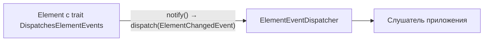

# События элементов (Event Dispatcher)

В form-generator реакция на изменение элементов реализована через **диспетчер событий**, а не через классический Observer.



## Классы библиотеки

| Класс | Назначение |
|-------|------------|
| `Event\ElementEventDispatcher` | Регистрация слушателей и `dispatch()` |
| `Event\ElementChangedEvent` | Событие с `getElement()` — источник изменения |
| `Element\Trait\DispatchesElementEvents` | `setDispatcher()`, `notify()` на элементах |

## Быстрый старт

```php
use Kavalhub\FormGenerator\Event\ElementChangedEvent;
use Kavalhub\FormGenerator\Event\ElementEventDispatcher;
use Kavalhub\FormGenerator\Html\InputText;
use Kavalhub\FormGenerator\Html\Select;

$dispatcher = new ElementEventDispatcher();
$childSelect = new Select('city', ['' => '—']);

$dispatcher->addListener(ElementChangedEvent::class, function (ElementChangedEvent $event) use ($childSelect): void {
    $regionId = $event->getElement()->getValue();
    // пересобрать options у $childSelect по $regionId
});

$parentSelect = (new Select('region', $regions))->setDispatcher($dispatcher);

// после bind значений из request:
$parentSelect->notify();
```

Для AJAX замените зависимый блок через `ElementAjaxHandler::handleBlock($childSelect)`.

## ElementFactory

При программной сборке элементов передайте диспетчер:

```php
ElementFactory::SET_DISPATCHER => $dispatcher,
```

## Demo: фильтр фасетов

В `example/Env/FacetProductForm` группы фасетов получают общий `ElementEventDispatcher`. Слушатель `FacetSelectionListener` подписан на `ElementChangedEvent` и собирает выбранные значения после `$form->notify()`.

Это не связанные select, а агрегация состояния чекбоксов — но тот же механизм событий применим и к зависимым спискам.

## Observer vs Dispatcher (история)

Ранее использовался `ElementObserverInterface` с `attachObserver()` / `update()`. С 3.3+ вместо него — диспетчер: слабее связность, несколько слушателей на одно событие, единая точка подписки на уровне формы.
